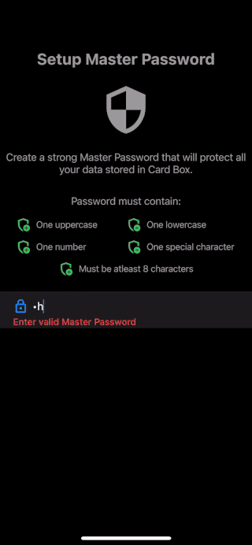

# 💳 CardBox

A secure, offline-first Flutter app for storing and managing credit/debit cards with encryption and biometric authentication.


[](https://flutter.dev)
[](https://flutter.dev)
[](https://www.zetetic.net/sqlcipher/)
[](LICENSE)

---

## 🚀 Features

- 🔐 **AES-256 Encryption** - All data encrypted using SQLCipher
- 👆 **Biometric Authentication** - Face ID/Fingerprint protection
- 📱 **Offline-First** - Works without internet connectivity
- 🏦 **Bank Grouping** - Organize cards by financial institutions
- 📤 **Secure Sharing** - Share card details via messaging apps
- 💳 **Comprehensive Storage** - Store CVV, PIN, UPI, and more
- 🌐 **Cross-Platform** - iOS and Android support

## 📸 Screenshots

<div align="center">
  
</div>

## 🛠️ Tech Stack

```yaml
dependencies:
  flutter: SDK                    # 🎯 Cross-platform framework
  sqflite_sqlcipher: ^2.1.0      # 🔐 Encrypted SQLite database
  local_auth: ^1.1.8            # 👆 Biometric authentication
  flutter_secure_storage: ^4.2.1 # 🔒 Secure key storage
  share_plus: ^3.0.4            # 📤 Secure sharing
  modal_bottom_sheet: ^2.0.0    # 📱 UI components
  flutter_swiper_null_safety: ^1.0.2 # 🎠 Card carousel
```

## 🔐 Security Features

### Biometric Authentication
```dart
Future<bool> authenticate() async {
  return await auth.authenticate(
    localizedReason: 'Authenticate to access CardBox',
    useErrorDialogs: true,
    stickyAuth: true,
    biometricOnly: true,
  );
}
```

### Encrypted Database
```dart
return await openDatabase(
  path,
  password: masterPassword,  // AES-256 encryption key
  version: _dbVersion,
  onCreate: _onCreate,
);
```

### Secure Key Storage
```dart
final _storage = const FlutterSecureStorage();
await _storage.write(key: masterPassKey, value: password);
```

## 📁 Project Structure

```
lib/
├── main.dart                    # 🚀 App entry point
├── src/
│   ├── app.dart                # ⚙️ App configuration
│   ├── auth/                   # 🔐 Authentication layer
│   │   ├── auth_service.dart   # 👆 Biometric auth logic
│   │   └── auth_view.dart      # 🖥️ Login/setup UI
│   ├── models/                 # 📊 Data models
│   │   └── models.dart         # 💳 Card, Group, Bank models
│   ├── group_list/             # 📋 Group management
│   ├── card_detail/            # 🔍 Card details view
│   ├── manage_group/           # ✏️ Group CRUD operations
│   ├── card_widget/            # 🎨 Credit card UI components
│   ├── settings/               # ⚙️ App settings
│   └── databse_service.dart    # 🗄️ Encrypted database layer
```

## 🏦 Supported Banks

The app supports 17 major Indian banks:

- HDFC Bank, ICICI Bank, Axis Bank
- State Bank of India, Kotak Mahindra Bank
- Canara Bank, Bank of Baroda, Punjab National Bank
- And 9 more banks with custom logos

## 💳 Data Model

```dart
class CardItem {
  int? cardId;
  String? cardHolderName;
  int? cardNumber;
  String? cardExpiryDate;
  String? cardCvvCode;
  String? cardPin;
  String? upiId;
  String? upiPin;
  // ... and more fields
}
```

## 🚀 Quick Start

### Prerequisites
- Flutter SDK (>=2.12.0)
- Android Studio / Xcode
- iOS 11+ / Android 5+

### Installation

1. **Clone the repository**
   ```bash
   git clone https://github.com/sharathpc/cardbox.git
   cd cardbox
   ```

2. **Install dependencies**
   ```bash
   flutter pub get
   ```

3. **Run the app**
   ```bash
   flutter run
   ```

## 📱 User Flow

1. 🚀 **First Launch** - Setup master password with strong validation
2. 🔐 **Authentication** - Biometric authentication on app launch
3. 📋 **Group Management** - Create bank groups for organization
4. ➕ **Card Addition** - Add cards with comprehensive information
5. 💳 **Card Management** - View, edit, and share card details
6. 🔒 **Security** - Automatic encryption and secure storage

## 🔮 Roadmap

### Planned Features
- ☁️ **Cloud Backup** - Secure cloud synchronization
- 🔢 **PIN Fallback** - Alternative authentication methods
- 📱 **NFC Integration** - Contactless card sharing
- 📱 **QR Code Sharing** - Quick card information sharing
- 📊 **Transaction History** - Track card usage patterns
- ⏰ **Expiry Notifications** - Alert for expiring cards

### Technical Improvements
- 🔄 **State Management** - Implement Provider or Riverpod
- 🧪 **Testing** - Comprehensive unit and widget tests
- ⚡ **Performance** - Optimize database queries
- ♿ **Accessibility** - Enhanced accessibility features

## 📊 Performance

- 📱 **App Size**: ~15MB (including assets)
- ⚡ **Launch Time**: <2 seconds
- 🗄️ **Database Operations**: <100ms for queries
- 💾 **Memory Usage**: ~50MB during normal operation
- 🔋 **Battery Impact**: Minimal background processing

## 🎯 Use Cases

- 👤 **Individuals** - Managing personal credit/debit cards
- 👨‍👩‍👧‍👦 **Families** - Sharing card information securely
- 💼 **Business Users** - Managing corporate cards
- ✈️ **Travelers** - Accessing card details offline

## 🔐 Security Best Practices

1. 🔒 **Never store sensitive data in plain text**
2. 🛡️ **Use platform-specific secure storage**
3. 🔑 **Implement proper authentication flows**
4. ✅ **Validate all user inputs**

## 🛠️ Development Challenges

### Challenge 1: Database Encryption
**Problem**: Implementing secure local storage for sensitive data.
**Solution**: Used `sqflite_sqlcipher` with AES-256 encryption and secure key storage.

### Challenge 2: Biometric Authentication
**Problem**: Ensuring consistent authentication across platforms.
**Solution**: Implemented `local_auth` with fallback mechanisms and proper error handling.

### Challenge 3: UI/UX Design
**Problem**: Creating an intuitive interface for sensitive financial data.
**Solution**: Adopted iOS design patterns with clear visual hierarchy and secure interaction patterns.

## 🤝 Contributing

1. Fork the repository
2. Create your feature branch (`git checkout -b feature/AmazingFeature`)
3. Commit your changes (`git commit -m 'Add some AmazingFeature'`)
4. Push to the branch (`git push origin feature/AmazingFeature`)
5. Open a Pull Request

## 📝 License

This project is licensed under the MIT License - see the [LICENSE](LICENSE) file for details.

## 🔗 Resources

- 📚 **Flutter Documentation**: [https://flutter.dev](https://flutter.dev)
- 🔐 **SQLCipher**: [https://www.zetetic.net/sqlcipher/](https://www.zetetic.net/sqlcipher/)
- 👆 **Local Auth**: [https://pub.dev/packages/local_auth](https://pub.dev/packages/local_auth)

## ⭐ Support

If you find this project useful, please give it a ⭐ on GitHub!

---

**Built with ❤️ using Flutter** 